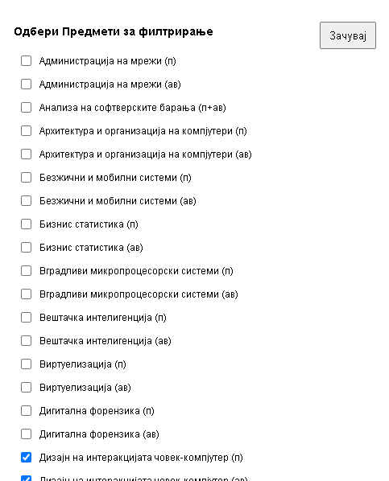
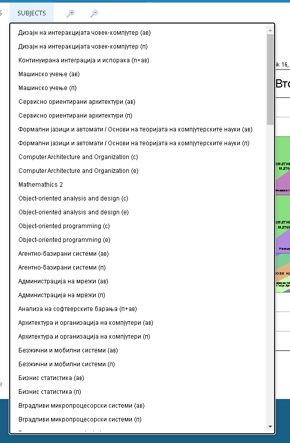
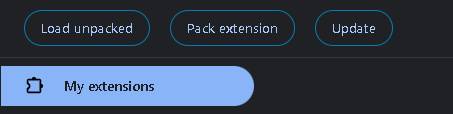

# Timetable Extension - Option Saver

This extension can be used locally by installing on your chrome browser

Initial idea is to save time by keeping preferences for your options of courses to save time.

## Choosing a courses for first displaying in the dropdown

## View when changes are applied

# How to use it

1. Download the folder
2. Click Manage Extension, and you will have a view where you can import the extension (Click on Load unpacked)

3. Choose the downloaded folder and enjoy!